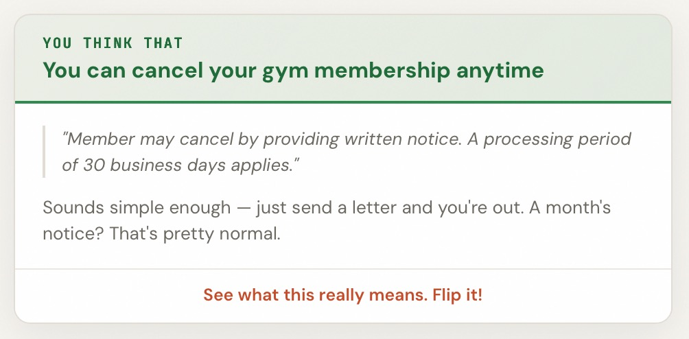
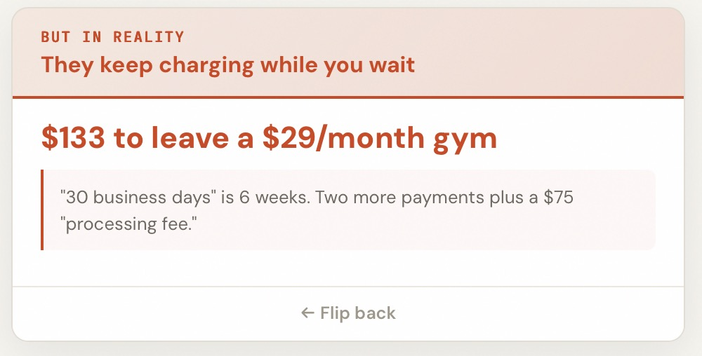
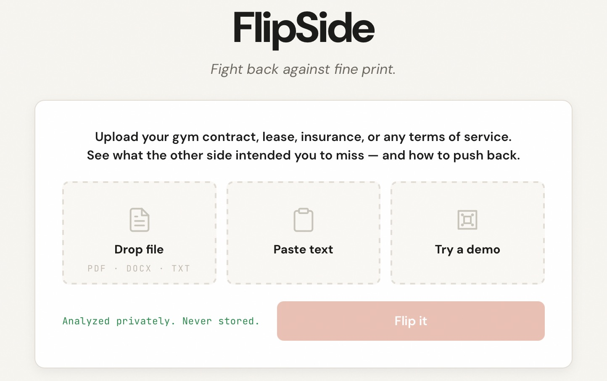
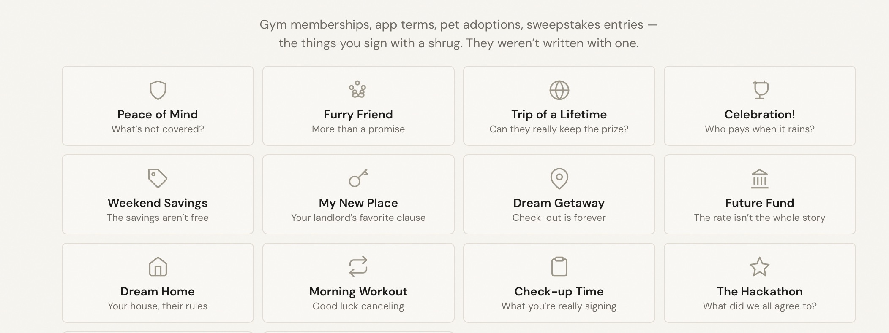
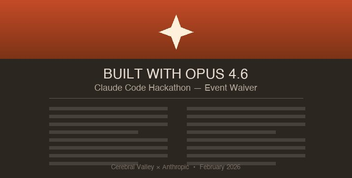
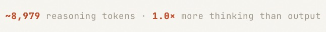
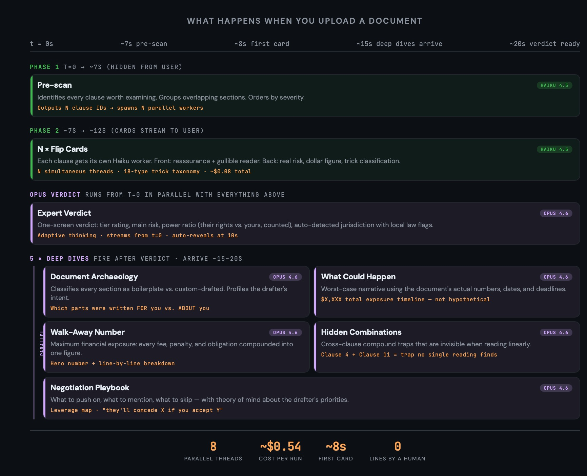

# FlipSide

[](https://www.python.org/downloads/)
[](https://opensource.org/licenses/MIT)
[](https://github.com/voelspriet/flipside/releases)
[](https://www.anthropic.com/news/claude-opus-4-6)
[](https://claude.ai/claude-code)

**The dark side of small print.**

Gym memberships, app terms, pet adoptions, sweepstakes entries — the things you sign with a shrug. They weren't written with one.

*0% of the code was written by a human. 14,000+ lines, 134 commits, 6 days — built entirely through conversation with [Claude Code](https://claude.ai/claude-code) and Opus 4.6.* See [coding.md](coding.md).









**Video:** [Watch the 3-minute demo](https://vimeo.com/1165331217)
**Try it:** [imagewhisperer.org/flipside](https://imagewhisperer.org/flipside)
**Source:** [github.com/voelspriet/flipside](https://github.com/voelspriet/flipside)

---

## The Problem

You probably didn't review the Coca-Cola sweepstakes rules that waive your right to sue. Or the pet adoption agreement that lets the breeder inspect your home for 5 years. Or the wedding venue "policy" that keeps your $15,000 deposit if it rains. These aren't edge cases — they're the documents most people actually encounter.

The problem isn't that people can't read. A clause that says "refunds calculated on a short-rate basis, not pro rata" is perfectly readable. It just doesn't mean anything to you until someone shows you it costs you 40% of your premium.

FlipSide treats a $2 coupon with the same seriousness as a $500,000 corporate lease. The tricks are the same — only the stakes change. Existing tools in legal tech — [Lawgeex](https://aiquiks.com/ai-tools/lawgeex), [LegalZoom](https://www.settlemate.io/blog/donotpay-alternatives), [AI contract review tools ranked in 2026](https://rankings.io/blog/best-ai-tools-for-contract-review/) — target lawyers and legal teams. Try finding one that handles gym memberships, coupons, or sweepstakes.

---

## What FlipSide Does

Every contract has a drafter. The drafter wrote it for a reason. FlipSide reads from the drafter's perspective — then shows you what they intended you to miss.

### The Flip

**Card front — what you'd think:**

> "Comprehensive coverage for your peace of mind"
>
> *OK, so my house is covered for "direct physical loss" — that sounds like everything. Water damage, fire, theft. That's exactly what I'm paying for.*

**Card back — what it really means:**

> **$0 payout on a $50,000 water damage claim.** Exclusion 2(c) excludes "gradual seepage over 14 days." Clause 2(e) sets the inspection window at 30 days. Together: virtually all residential water damage can be reclassified as "gradual" after the fact. The broad coverage on the front is a psychological anchor — it makes you stop reading before the exclusions.
>
> Score: 82/100 · Trick: PHANTOM PROTECTION · 18-type taxonomy

That's the product. The front is how the drafter *wants* you to feel. The back is what a $2,500/hour attorney would tell you.

### One-Screen Expert Verdict

While you flip cards, Opus 4.6 streams a verdict from t=0: **Verdict Tier** (5 levels, "Nothing to Worry About" → "Walk Away") · **The Main Thing** (worst risk + clause refs) · **One Action** (before committing) · **Power Ratio** (their rights vs. yours, counted from the document) · **Jurisdiction** (auto-detected, local law violations flagged) · **Colophon** (self-review for false positives).

### 5 Expert Deep Dives (Opus 4.6 in parallel)

| # | Report | What it does |
|---|--------|-------------|
| 1 | **Document Archaeology** | Boilerplate vs. custom-drafted — custom clauses reveal the drafter's real priorities |
| 2 | **What Could Happen** | Month-by-month worst case using the document's actual fees and compounding rules |
| 3 | **Walk-Away Number** | Maximum financial exposure as a hero dollar figure, every fee traced to its source clause |
| 4 | **Hidden Combinations** | Cross-clause traps invisible when reading linearly — clause 4 + clause 11 create risks neither reveals alone |
| 5 | **Negotiation Playbook** | What to push (they'll bend), what to skip (non-negotiable), with a ready-to-send message |

### Take Action

- **Ask follow-up questions** — *"What happens if I'm 3 months late on rent?"* Opus runs as a tool-use agent with 3 tools, up to 6 reasoning rounds per question.
- **Message the company** — One-click professional letter citing the high-risk clauses.
- **Counter-draft** — Opus rewrites unfair clauses with negotiable alternatives.
- **Download report** — Full PDF export. Non-English documents get a *"Report in [language]"* button.

### The Numbers

| N Haiku card workers + 6 Opus threads | ~8s first card | ~$0.54 per analysis |
|---|---|---|---|

---

### 14 Built-In Samples

No document handy? Pick a life moment:

| Your moment | The document | What FlipSide finds |
| --- | --- | --- |
|  **My New Place** | 12-month residential lease | Late fees that cascade into unpayable debt |
|  **Peace of Mind** | Homeowner's coverage plan | Two exclusion clauses interact to deny most real-world water damage claims |
|  **Morning Workout** | 24-month fitness membership | Auto-renewal kicks in silently; cancellation window is 30 days before a date they never told you |
|  **Weekend Savings** | Local store rewards program | "Savings" require minimum spend thresholds that make every "deal" cost more than buying at full price |
|  **First Day of Work** | Tech company offer letter | An at-will clause renders every other promise unenforceable |
|  **Future Fund** | Personal auto loan terms | A single late payment triggers a cascade of penalties designed to stack |
|  **Staying Connected** | Social media platform terms | "We may share with partners" means unrestricted sale to data brokers |
|  **Check-up Time** | Outpatient procedure consent | A liability waiver placed after medical disclosures to benefit from the assumption that everything on the form is standard |
|  **Dream Home** | Suburban community bylaws | The board can levy special assessments with no cap and fine you daily for violations defined at their sole discretion |
|  **Celebration!** | Event venue rental agreement | Force majeure protects the venue but not you — if they cancel, you get a credit; if you cancel, you lose everything |
|  **Furry Friend** | Shelter adoption contract | A return clause lets the shelter reclaim the animal at any time if they judge your care "inadequate" — no appeal |
|  **Dream Getaway** | Timeshare vacation package | The "cooling off" period is shorter than payment processing time, making the exit window structurally impossible to use |
|  **Trip of a Lifetime** | Sweepstakes official rules (real Coca-Cola) | Accepting the prize grants perpetual, worldwide rights to your name, likeness, and story — with no compensation |
|  **The Hackathon** | Event waiver we all signed (real) | You grant a perpetual, irrevocable license to all your Materials — code, ideas, feedback — with no confidentiality obligation |

Plus: **paste text directly** or upload your own PDF, DOCX, or TXT.

### Stress Tests

| Test | What happened |
| --- | --- |
| **West Frisian** (~500K speakers) | Correctly identified Dutch civil law (BW articles), translated inline quotes, delivered full English analysis. |
| **222-page cross-clause trap** (~167K tokens) | 36/36 planted traps caught — including Section 3 interacting with Section 297 (distance: 294 clauses). |
| **Orwellian titles** (8 clauses where titles contradict content) | All 8 title/content mismatches caught. Haiku renamed every clause to expose the contradiction. Identified the titling convention as a unified deceptive strategy. |
| **Dense legalese** (153-word single sentences) | 79% compression in plain-language REVEAL, correct dollar math, gullible reader voice deliberately misunderstood the trap. |
| **Empty document** (0 bytes) | Two-tier defense: backend rejects empty/whitespace uploads; Haiku "Not Applicable" gate catches non-contract text. Zero JS errors. |
| **Near-identical documents** (1 clause changed) | Correctly identified all 5 unchanged clauses as identical and flagged only the real difference. Purely semantic comparison. |

50 boundary probes total (6 PASSED with rigorous testing, 13 features built, 26 architecture-assessed). Full results: [boundary-probes.md](boundary-probes.md)

---

## Why Opus 4.6 Specifically

Three capabilities from [Anthropic's Opus 4.6 announcement](https://www.anthropic.com/news/claude-opus-4-6) are **structurally necessary** for FlipSide to work. Remove any one and the product degrades:

1. **Adaptive thinking — the reasoning IS the product.** Opus 4.6 introduces four effort levels (low, medium, high, max) where the model picks up on contextual clues about how much extended thinking to use. The Opus verdict thread decides its own reasoning depth: spending more thinking tokens on complex cross-clause interactions and less on standard boilerplate. Most projects use extended thinking as a black box. FlipSide makes it visible — the user watches Opus think in real time:



*The ratio tells the story.* `1.0×` means Opus spent as many tokens reasoning as it did writing output — a 1:1 ratio of thinking to answering. For a simple document this might drop to `0.3×`. For a 222-page cross-clause trap it climbs to `3.0×`+. The model decides how hard to think based on what it finds. The user sees this live — not after the fact.

2. **Long-context retrieval — finding legal traps spread across pages.** Opus 4.6 is the first Opus-class model with a **1M token context window** (beta). On the MRCR v2 8-needle 1M benchmark, it scores **76%** vs. Sonnet 4.5's **18.5%** — a 4x improvement that Anthropic calls "a qualitative shift in how much context a model can actually use." FlipSide applies this to cross-clause interaction detection: Clause 2(c) excludes water damage from "gradual seepage over 14 days." Clause 2(e) defines the inspection timeline at 30 days. Neither clause is dangerous alone. Together, they deny virtually all residential water damage claims. Tested to 222 pages (~167K tokens): 36/36 planted traps caught, including Section 3 interacting with Section 297 (distance 294 clauses).

3. **Low over-refusals — the perspective flip works.** Anthropic reports Opus 4.6 has the **lowest rate of over-refusals among all recent Claude models** while maintaining an overall safety profile "as good as, or better than, any other frontier model." The gullible reader voice on card fronts is deliberately naive and trusting. The verdict prompt analyzes from the drafter's strategic perspective, and card backs adopt an adversarial voice revealing what the drafter actually intended. Previous models would self-censor, add disclaimers, or refuse entirely. Opus 4.6 fully commits to the perspective flip — the core product mechanic. This is not a safety bypass — it's a safety-conscious model that understands the educational purpose of perspective-taking.

**Bonus: legal domain performance.** On BigLaw Bench, Opus 4.6 scores **90.2%** with **40% perfect scores** and 84% above 0.8. On GDPval-AA (economically valuable knowledge work in finance, legal, and other domains), it outperforms GPT-5.2 by **144 Elo points** and its predecessor Opus 4.5 by **190 points**. FlipSide puts that legal reasoning directly in the user's hands.

Plus: **vision** catches formatting tricks text extraction misses, **self-correction** reviews the analysis for false positives before the user sees it, **split-model parallel** lets Haiku deliver instant cards while 6 Opus threads build verdict + 5 expert reports simultaneously, **theory of mind** models the drafter's incentives for negotiation strategy, and **forensic arithmetic** traces every financial exposure to its source clause.

### Opus 4.6 Capabilities Used



FlipSide uses 14 Opus 4.6 capabilities — including three that Anthropic [specifically highlights in the Opus 4.6 announcement](https://www.anthropic.com/news/claude-opus-4-6): adaptive thinking, long-context retrieval, and low over-refusals. Each used capability is **visible in the product** — not a behind-the-scenes optimization. Six parallel Opus 4.6 threads run simultaneously, each exercising a different capability.

| # | Opus 4.6 Feature | What the user does | What Opus 4.6 does |
| --- | --- | --- | --- |
| 1 | **Adaptive thinking** | Uploads a document and sees the Opus verdict stream in ~30-60s. The model spends more reasoning on complex cross-clause interactions and less on straightforward sections. | The Opus verdict thread runs with `thinking: {type: 'adaptive'}`, meaning the model autonomously decides how many reasoning tokens to spend. A standard document gets a quick pass; a document with hidden cross-clause traps gets deep chain-of-thought. The user never configures this — Opus allocates its own thinking budget. |
| 2 | **Long-context retrieval** | Uploads a long document (tested up to 222 pages / ~167K tokens). Sees cross-clause interactions flagged in the verdict — e.g., "Clause 3 + Clause 297 create a compound trap." | The full document text is sent to the Opus verdict thread (`build_verdict_prompt`). The verdict prompt instructs cross-clause reasoning across the entire document. Opus must hold the entire document in context and connect clauses that may be hundreds of pages apart. Tested with 9 synthetic documents up to 300 clauses — 36/36 planted traps caught including Section 3 interacting with Section 297 (distance 294 clauses). |
| 3 | **Low over-refusals** | Reads adversarial role-play in the verdict where the analysis adopts the drafter's perspective. The gullible reader voice on card fronts is deliberately naive; the card backs reveal what the drafter intended. Example: *"The math does the work. Two weeks late once and you'll never catch up."* | The card scan prompt creates a gullible reader who trusts the drafter completely. The verdict prompt analyzes from the drafter's strategic perspective; card backs adopt an adversarial voice revealing what the drafter intended. Previous models would self-censor, add disclaimers, or refuse. Opus 4.6 fully commits to the perspective flip — the core product mechanic. |
| 4 | **Follow-up Q&A** | After analysis, types questions like "What happens if I'm 3 months late on rent?" or "Which clauses can I negotiate?" and gets traced answers with tool-call indicators visible on screen. | Each follow-up runs Opus as a tool-use agent with three tools: `search_document` (full-text search of the contract), `get_clause_analysis` (retrieves a specific flip card's analysis), and `get_verdict_summary` (retrieves the verdict). Opus autonomously decides which tools to call, searches the document server-side, and traces answers through relevant clauses — up to 6 reasoning rounds per question. Each question starts fresh (no accumulated history between questions). |
| 5 | **Vision / multimodal** | Uploads a PDF. Sees findings about visual tricks — fine print, buried placement, dense tables, light-gray disclaimers — that text extraction alone would miss. | PDF pages are rendered as JPEG images (150 DPI, up to 10 pages, max 4MB each) and sent as multimodal content blocks alongside the extracted text to the Opus verdict thread. The prompt includes: "Page images are included. Look for visual tricks: fine print, buried placement, dense tables, light-gray disclaimers." Opus processes both the text and the visual layout simultaneously. |
| 6 | **Structured output via prompts** | Sees consistently structured flip cards with risk scores, trick types (from a taxonomy of 18), confidence levels, figures, and examples — every clause in the same format. | Rather than using formal tool definitions, FlipSide achieves structured output through detailed prompt engineering. The card scan prompt specifies an exact output format with tagged fields (`[REASSURANCE]`, `[REVEAL]`, `Score:`, `Trick:`, etc.) and a constrained vocabulary of 18 trick types. The frontend parses these fields with regex. *The original plan included `assess_risk` and `flag_interaction` tool schemas, but prompt-based structuring proved more reliable for streaming.* |
| 7 | **Self-correction** | Reads the "Quality Check" in the verdict's colophon — where the analysis reviews itself for false positives and blind spots before the user acts on it. | The Opus verdict prompt (`build_verdict_prompt`) includes a dedicated `[COLOPHON]` section with methodology notes and self-review. The prompt instructs: "Be genuinely self-critical. Users trust uncertainty over false certainty." This runs as part of Opus's single output pass for the verdict. |
| 8 | **Split-model parallel** | First flip card appears within seconds; verdict + 5 expert reports stream from t=0. Progress counter shows "3 of 5 expert reports ready." | Two-model pipeline: Haiku 4.5 pre-scans during upload, then N parallel Haiku workers build flip cards. Six Opus 4.6 threads fire at t=0 in parallel: verdict + archaeology + scenario + walk-away + combinations + playbook. SSE stream is never blocked. Deep dives arrive as collapsible sections with live progress tracking. Haiku for instant structured cards, Opus for cross-clause reasoning, causal chains, financial arithmetic, drafter modeling, and self-correction. |
| 9 | **Prompt caching** | Analyzes multiple documents without paying full price each time. The system prompts (which are identical across runs) are cached by Anthropic's API. | All analysis API calls use `cache_control: {type: 'ephemeral'}` on the system prompt, activating Anthropic's prompt caching (5-minute TTL). Cached input tokens cost 90% less than uncached. The actual per-run savings depend on the ratio of system prompt tokens (cached) to document tokens (not cached) — significant for repeated analyses but less than 90% of total cost. |
| 10 | **Theory of mind** | Sees the Negotiation Playbook: what to push on (they'll bend), what to mention (builds credibility), what to skip (non-negotiable). Includes a ready-to-send message. | The playbook thread (`build_playbook_prompt`) runs as a parallel Opus 4.6 call from t=0. Opus models the drafter's incentives to predict which concessions they'll grant. The prompt instructs: "Be specific to THIS document — no generic negotiation advice." The drafter profile predicts behavior, not just structure. |
| 11 | **Stylistic deduction** | Sees Document Archaeology: each section classified as boilerplate vs. custom-drafted. Custom clauses reveal the drafter's real priorities. | The archaeology thread (`build_archaeology_prompt`) runs as a parallel Opus 4.6 call from t=0. Classifies each major section as **Boilerplate** or **Custom**, then profiles the drafter type. Example: "This lease pattern is typical of high-volume property management companies optimizing for automated enforcement." Custom clauses are the signal — they reveal what the drafter cared enough to modify. |
| 12 | **English-only + download in language** | Reads the entire analysis in English regardless of document language. For non-English documents, sees a "Report in [language]" button that downloads the full analysis translated to the original language. | Every prompt includes `## LANGUAGE RULE: ALWAYS respond in ENGLISH regardless of the document's language.` Quotes are kept in the original language with English translations in parentheses. The frontend detects the document language from Haiku's output, shows a download button for non-English docs, then streams a full translation through Opus and generates a downloadable HTML report. Tested on West Frisian (~500K speakers) — correctly identified language, translated inline, cited Dutch BW articles. |
| 13 | **Causal chain reasoning** | Sees "What Could Happen": a month-by-month worst-case scenario using the document's actual fees, deadlines, and compounding rules. Total exposure at the end. | The scenario thread (`build_scenario_prompt`) runs as a parallel Opus 4.6 call from t=0. Opus picks the most likely trigger (missed payment, illness, schedule conflict), then traces clause chains through 3-6 months with the document's real numbers. The prompt instructs: "Pick the MOST LIKELY trigger, not the most dramatic." Self-check rule: "verify the total exposure equals the sum of all individual fees." |
| 14 | **Forensic arithmetic** | Sees the Walk-Away Number: maximum financial exposure as a hero dollar figure with a line-by-line breakdown. Comparison to industry norms included. | The walkaway thread (`build_walkaway_prompt`) runs as a parallel Opus 4.6 call from t=0. Opus finds every financial exposure (deposits, penalties, termination costs, compounded late fees, liability caps, insurance, interest), sums them, and verifies. Breakdown ordered largest to smallest. Self-check: "The TOTAL must equal the sum of the breakdown items — verify your math." |

<details>
<summary>Capabilities considered but not used</summary>

| # | Opus 4.6 Feature | Why not used |
| --- | --- | --- |
| 15 | **Depth presets** | UI selector exists (Quick/Standard/Deep). Currently all analysis runs at fixed token budgets while we validate output quality per tier. Architecture ready for Opus 4.6's native `effort` parameter — one-line change. |
| 16 | **Confidence calibration** | Model generates per-clause confidence levels (HIGH/MEDIUM/LOW). CSS badges defined; display rendering not yet wired up — data captured for future use. |
| 17 | **Effort controls** | Four explicit effort levels (low, medium, high, max). Our depth selector currently maps to `max_tokens` instead. Architecture is ready — one-line change when SDK support lands. |
| 18 | **Context compaction** | Automatically summarizes older context for longer tasks. Each FlipSide follow-up re-sends the full document as a fresh single-turn call — no conversation history accumulates. |
| 19 | **Tool use** | Structured function calling. We planned `assess_risk` and `flag_interaction` tools but found prompt-based output formatting more reliable for streaming incremental cards. |
| 20 | **Memory (beta)** | Persistent memory across conversations. FlipSide is stateless by design: upload, analyze, done. No user accounts, no session persistence. |
| 21 | **Citations** | Native passage citation. We built our own citation system with numbered clause markers and verbatim quotes. Native citations could replace our regex-based extraction, but our visual marker system would still need custom rendering. |
| 22 | **Computer use** | Desktop/browser interaction. FlipSide is an API-driven web app — not applicable. |

</details>

---

### Engineering Highlights

**Prefilled assistant turn** — The clause identification scan uses a prefilled `CLAUSE:` assistant turn, forcing Haiku's very first output token to be a clause — zero preamble, zero wasted tokens. Combined with a stripped identification format (title + section only, no risk/score/trick), the prescan runs faster and card workers determine risk independently.

**Mid-stream thread spawning** — Card workers launch while the clause identification scan is still streaming. The moment a `CLAUSE:` line arrives in Haiku's response, a card generation thread spawns — before the scan is finished. Clause titles stream to the loading screen as live previews ("Found: Non-Compete Clause") while workers run in parallel.

**Upload-time pre-computation** — LLM calls begin during file upload, hiding latency inside the UX dead zone (screen transition + loading animation). If cards finish before the SSE connection opens, they emit instantly — zero wait.

**Scored narration from thinking stream** — The loading screen shows real sentences from Opus's thinking, not canned placeholders. A scoring function ranks candidate sentences by specificity: dollar amounts (+3), party names (+2), legal concepts (+2), risk language (+2). Generic LLM self-talk is suppressed. The user sees *"Non-compete restricts employees for 24 months"* instead of *"Building a mental model of the agreement."*

**Vocabulary-constrained personas** — The Reader voice uses a forbidden-word list with morphological roots (`"waiv"` catches waive/waiver/waiving) plus plain-language replacements. This makes it structurally impossible for the model to leak legal awareness into what should be a trusting, non-expert voice — more reliable than persona instructions alone.

**Each Haiku card serves three purposes** — The same card output is (1) a user-facing flip card, (2) input to an instant flash verdict while Opus works, and (3) structured context injected into the Opus prompt so expert analysis builds on findings rather than rediscovering them.

**Interaction-gated onboarding** — Navigation, keyboard shortcuts, and the verdict strip stay hidden until the user physically flips their first card. Every user must experience the reassurance → reveal moment before browsing freely. The product thesis is communicated through the mechanic, not explanation.

**Prompt caching across parallel workers** — The card generation system prompt (instructions, trick taxonomy, formatting rules) is shared across all N parallel Haiku workers with `cache_control: ephemeral`. Workers 2–N get Anthropic prompt cache hits on the system prompt — the document text is per-card in the user message.

---

## Quick Start

```bash
git clone https://github.com/voelspriet/flipside.git
cd flipside
pip install -r requirements.txt
echo "ANTHROPIC_API_KEY=your-key-here" > .env
python app.py  # opens on http://localhost:5001
```

---

## Architecture

```
                    User uploads document / picks sample / pastes text
                                      |
                                      v
                      Flask extracts text (PDF/DOCX/paste)
                                      |
                              Haiku pre-scan identifies clauses
                                      |
          +---------------------------+---------------------------+
          |                           |                           |
          v                           v                           v
   +-------------+    +-------------------------------+    +------------------+
   |  HAIKU 4.5  |    |         OPUS 4.6 × 6         |    |  SSE stream      |
   |  N parallel |    |  all fire at t=0 in parallel  |    |  opens at t=0    |
   |  card       |    |                               |    |                  |
   |  workers    |    |  1. Verdict (one-screen)      |    |  Opus events     |
   |             |    |  2. Archaeology (boilerplate)  |    |  flow immediately|
   |  Full cards |    |  3. Scenario (worst-case)     |    |                  |
   |  (front +   |    |  4. Walk-Away Number ($)      |    |  Cards + verdict |
   |   back)     |    |  5. Combinations (traps)      |    |  + 5 reports     |
   |             |    |  6. Playbook (negotiate)      |    |  arrive as done  |
   +------+------+    +-------------------------------+    +------------------+
          |                           |
     +----+----+                      |
     v         v                      v
  First card  Cards trickle    Verdict + 5 expert
  at ~8s      in ~8-15s        reports ~15-20s
```

**Stream-First Pipeline**

| Stage | Agent | What It Does | What the User Sees |
| --- | --- | --- | --- |
| 1. Upload Prescan | Haiku 4.5 | Identifies clauses during upload; card workers launch from results | Investigation screen with real document text + scanning loupe |
| 2. Parallel Cards | Haiku 4.5 x N | N parallel workers generate full flip cards (front + back) | First card appears at ~8s, rest trickle in. Fastest card first. |
| 3. Expert Verdict | Opus 4.6 | One-screen verdict: tier, main risk, power ratio, jurisdiction, checklist | Streams from t=0. Auto-reveals at 10s if cards haven't arrived. |
| 4. Document Archaeology | Opus 4.6 (parallel) | Classifies every section as boilerplate vs. custom-drafted, profiles the drafter | Collapsible report section, arrives ~15-20s |
| 5. What Could Happen | Opus 4.6 (parallel) | Worst-case scenario: narrative timeline using document's actual numbers and deadlines | Collapsible report section, arrives ~15-20s |
| 6. Walk-Away Number | Opus 4.6 (parallel) | Maximum financial exposure: every fee, penalty, and obligation compounded | Hero number + breakdown, arrives ~15-20s |
| 7. Hidden Combinations | Opus 4.6 (parallel) | Cross-clause compound traps invisible when reading linearly | Collapsible report section, arrives ~15-20s |
| 8. Negotiation Playbook | Opus 4.6 (parallel) | What to push on, what to mention, what to skip — with theory of mind about the drafter | Collapsible report section, arrives ~15-20s |
| 9. Follow-up | Opus 4.6 (interactive) | User questions, Opus traces through all clauses | Consultation + message-the-company |

**Pipeline parallelism — the key optimization.** Clause identification runs during upload as a Haiku pre-scan. N parallel Haiku card workers launch from the pre-scan results. Cards emit in completion order (fastest first), not index order. Six Opus 4.6 threads — verdict + 5 specialist deep dives — all fire at t=0 in parallel with card generation. The SSE stream is never blocked: Opus events flow from t=0, and deep-dive results stream in as each thread completes. The user sees "Verdict ready — 3 of 5 expert reports building" with a progress counter that updates live. All 6 Opus analyses complete within ~20s wall-clock time (parallel, not sequential).

**Key architectural insight:** We originally put Opus 4.6 on the card backs — assuming the flip needed the most powerful model. Haiku does a great job on cards. Opus's real value is in the work Haiku *can't* do: cross-clause reasoning, power analysis, jurisdiction detection, and self-correction. We started with 4 parallel Opus threads, consolidated to 1 verdict + 4 on-demand deep dives, then expanded to 6 parallel threads when we realized the wall-clock cost of running them all at t=0 is zero (parallel) while the UX gain is enormous (everything arrives together). Each thread exercises a different Opus 4.6 capability — see the capabilities table above. See [strategy.md](strategy.md) for the full decision story.

**Tech stack:** Python/Flask, Server-Sent Events, Anthropic API (Haiku 4.5 for cards + Opus 4.6 for verdict with adaptive thinking, vision, prompt caching). Single-file frontend by design — zero build step, instant deploy, hackathon velocity. CSS custom properties, ease-out-expo animations, SSE streaming for real-time card rendering, and DOMPurify for XSS defense on all LLM output. 14 built-in sample documents with generated thumbnails (including a real Coca-Cola sweepstakes and the real hackathon event waiver). No external APIs beyond Anthropic. No database required. Deployable behind a reverse proxy with URL prefix.

---

## The Three-Minute Problem

The hardest UX challenge in FlipSide isn't the analysis — it's the wait. Opus 4.6 needs time to reason across an entire document: cross-clause interactions, jurisdiction detection, power ratio calculation, self-correction. That takes up to 60 seconds for the verdict alone, plus 15-20 seconds each for five specialist deep dives. A user who sees a loading spinner for three minutes will leave.

The solution: **never let the user wait for something they can't interact with.**

| Time | What the user sees | What's actually happening |
| --- | --- | --- |
| **0–7s** | Investigation screen: document text scrolling, scanning loupe sweeping, clause titles appearing live ("Found: Non-Compete Clause"). **Expert Mind**: scored narration from Opus's thinking stream — real document-specific sentences, not canned text. | Haiku pre-scan with prefilled assistant turn identifies clauses instantly. Clause previews stream to loading screen. N parallel card workers launch mid-scan. Opus verdict thread starts with adaptive thinking. 5 specialist Opus threads fire in parallel. |
| **~8s** | Cards whoosh in. First flip card appears. Navigation hidden — forcing the user to flip. | Pre-scan complete. Parallel card workers returning results. |
| **8–20s** | User flips cards. Each flip dims the sidebar, reveals the back: risk score, trick name, dollar figure. Green cards prove calibration ("not everything is a trap"). **Verdict progress strip** glows below the nav: "Expert verdict building..." | Remaining card workers finish. Opus verdict thread streaming. Progressive tag rendering: core verdict sections unlock early. |
| **~15–20s** | Progress strip updates: "Expert verdict ready — 3 of 5 reports building." Strip transforms into a quiet CTA. Expert reports arrive one by one with collapsible panels. | Verdict complete. Specialist deep dives completing in parallel. |
| **~20s+** | All 5 reports landed. "Read your verdict" CTA. Go Deeper buttons unlocked. Follow-up question input appears. User scrolls to one-screen verdict — or keeps browsing cards. | Everything complete. On-demand interactions only. |

**Why this works:**

1. **Cards are the product, not the loading state.** The flip card mechanic is engaging on its own — each card is a micro-revelation. Users don't experience the Opus wait because they're busy flipping.

2. **Every second has visible progress.** The investigation screen has animated text, the Expert Mind shows live thinking sentences, the progress strip fills, reports arrive. There is no moment where nothing is happening on screen.

3. **The system never interrupts.** Verdict strip state changes are deferred while the user is mid-flip (the Apple notification pattern — hold updates until the user lifts their finger). Automatic content updates never scroll the page. The system *knows* the verdict is ready but waits for a natural pause point to announce it.

4. **Progressive disclosure matches attention.** Cards arrive when curiosity is highest. The verdict arrives when the user has context from the cards. Deep dives arrive when the user has questions. Each layer answers the question the user is asking *at that moment*.

5. **The 10-second safety net.** If cards haven't arrived after 10 seconds (slow network, long document), the verdict auto-reveals — the user always has something to read. A "cards ready" pill appears when they finally arrive.

The result: in testing, users spend 2-3 minutes browsing cards and reading the verdict — exactly the time the analysis needs. They don't notice the wait because there is no wait. There is only the next card to flip.

---

## FlipSide vs. Anthropic's Legal Plugin

On February 2, 2026, Anthropic launched a [legal plugin for Claude Cowork](https://legaltechnology.com/2026/02/03/anthropic-unveils-claude-legal-plugin-and-causes-market-meltdown/) — enterprise contract review that crashed legal tech stocks by $50B+. FlipSide approaches the same domain from the opposite direction. The plugin reviews contracts FOR legal teams. FlipSide reveals what the drafting team intended — for the millions of people who sign documents without a legal team. Same model. Different side of the table.

|  | Anthropic Legal Plugin | FlipSide |
| --- | --- | --- |
| **User** | In-house corporate counsel | Anyone who received a document they didn't write |
| **Perspective** | Reviews FROM your configured playbook | Flips TO the drafter's perspective — no playbook needed |
| **Documents** | Contracts your legal team handles | Anything: leases, insurance, ToS, gym memberships, coupon booklets, sweepstakes rules, pet adoption papers |
| **Output** | Redline suggestions, NDA triage | Flip cards, villain voice, YOUR MOVE actions, message-the-company, counter-draft |
| **Requires** | Cowork enterprise license, MCP integrations, configured playbook | Nothing — upload and go. Or pick a sample. |
| **Approach** | Automates what a lawyer already does | Reveals what the lawyer on the other side was thinking |

---

## The Meta-Prompting Discovery

When you ask Claude to **"analyze this contract"**, you get a decent analysis. But when you ask Claude to **"write a prompt for analyzing this contract"** and then say **"now execute that prompt"** — the results are dramatically better.

Why? The two-step approach forces the model to separate *planning* from *execution*. In the first step, it reasons about what makes a good analysis. In the second step, it follows its own expert framework. It's chain-of-thought at the meta level.

During the hackathon AMA, we asked **Cat Wu** (Product Lead and co-creator of Claude Code) directly: *"'Give me a prompt to analyze [topic]' then 'execute prompt' works way better than 'analyze this topic' — why is that?"*

Cat's answer:

> "We have noticed this as well, which is why we've shipped things like prompt improver. My best guess is that it's changing the model from doing fast thinking to slow thinking. Like if you ask a coworker 'can you take a quick look at X?' they might do an 80% pass. Whereas if you meet with that coworker for 30 minutes and say 'we really need to do this, this is why it's important,' they might go back and do more thorough work. I think it's possible that asking the model to improve the prompt causes the model to believe that this is a more important thing to do, that it should be more comprehensive in."

Our hypothesis: the two-step approach forces the model to reflect on the task itself (what makes good analysis, what biases to avoid) rather than just what the user wants.

We validated the pattern by running 30 Opus 4.6 agents (10 tasks x 3 approaches: direct action, plan mode, meta-prompt) and documented 7 real before/after cases from the build. The full analysis — including methodology caveats and an honest limitations section — is in [meta-prompting-strategy.md](meta-prompting-strategy.md).

FlipSide's entire architecture is a **productized version of this discovery**. The system prompt teaches Claude *how to think about documents*: adopt the drafter's perspective, apply a taxonomy of 18 legal trick types (Silent Waiver, Time Trap, Cascade Clause, Phantom Protection, Honey Trap...), contrast "what the small print says" against "what you should read." The prompt is a pre-built reasoning framework that every uploaded document executes against.

The user never sees this meta-prompt. They just see better results.

---

## What's Next

* **Mobile version** — Full FlipSide experience on phone and tablet.
* **Private data stripper** — Strip personal information before upload, based on [AI Whisperer](https://github.com/voelspriet/aiwhisperer). Your data never leaves your device.
* **Browser extension** — Flag Terms of Service on any website before you click "I Agree." The same pipeline, triggered by a single button on any page with legal text.
* **Collaborative review** — Share your analysis with a lawyer or community group via link.
* **Benchmarking** — Compare your lease or insurance policy against anonymized analyses of similar documents. *"Your landlord's late fee clause is harsher than 82% of leases we've seen."*

---

## Builder

**Henk van Ess** — See [BUILDER_PROFILE.md](BUILDER_PROFILE.md).

## Hackathon

Built with Opus 4.6: a Claude Code Hackathon (February 2026)

---

## But Wait — We Ran FlipSide on the Hackathon Waiver

We fed FlipSide the very document we signed to enter this hackathon. Here's what it found.

**Deep Document Check:** Roughly 60% standard event-waiver boilerplate. The custom-drafted intellectual property and data provisions are specifically engineered to give the organizers an irrevocable license to everything participants create, share, or even casually mention during the event — while paying prizes exclusively in API credits.

### The Flip Cards

| # | Front (What You'd Think) | Back (What It Really Means) | Severity |
|---|---|---|---|
| 1 | "We need rights to showcase hackathon projects" | They can use anything you share, pitch, or mention — forever, with zero confidentiality. The "Materials" license covers ideas, feedback, casual Slack messages, everything. | **AGGRESSIVE** |
| 2 | "You retain ownership of your submission" | The license grants "use, reproduce, adapt, modify, create derivative works, exploit for any purpose without restriction." You own the title; they own the movie rights. | **AGGRESSIVE** |
| 3 | "Win up to $50,000 in prizes" | All prizes are API credits — not cash. Credits cost the organizer a fraction of face value while locking winners into the platform. You may owe real-dollar taxes on credits you can't liquidate. | **UNUSUAL** |
| 4 | "Your data helps improve the event" | Personal data shared with unnamed sponsors for marketing — no opt-out mechanism, no limitation on which sponsors, no restriction on duration. | **STANDARD** |
| 5 | "We may update these terms" | Only "significant" changes require notice — and "significant" is undefined by the organizers. Non-significant changes require no notice at all. | **STANDARD** |

### Hidden Combinations

1. **They Own Everything You Even Whisper.** The "Materials" license + the "Submission" license together: zero IP you touch during this event isn't perpetually licensed to the organizers — and the Materials license is transferable and sub-licensable.

2. **They Can Kick You Out and Keep Your Work Forever.** Subjective conduct policy + unconditional IP license with no termination trigger. You leave with nothing; they keep everything.

3. **Your Employer Finds Out, You Pay the Organizers' Legal Bills.** You warrant sole ownership. They strip confidentiality and publish. When your employer sues the organizers — you pay their attorney's fees under the indemnification clause.

4. **They Can Cancel After You've Worked 7 Days — And You Can't Sue.** No qualifying language, no obligation to award prizes for completed work. Your seven days of labor evaporate with zero recourse.

5. **They Can Change the Rules After You Sign — And You've Already Waived Claims You Don't Know About Yet.** The 1542 waiver + the modification clause: you pre-waived the right to challenge unknown future claims while they retain unilateral power to alter the terms that generate those claims.

### The Negotiation Playbook's Opening Move

> *"I'd like to discuss the Release of Information section — specifically the scope of the 'Materials' license. As written, it appears to grant a perpetual, transferable, sub-licensable license over anything I 'provide, share, or use' during the Event, which could sweep in pre-existing proprietary code. Would you be open to adding a carve-out clarifying that pre-existing IP is excluded?"*

### FlipSide's Conclusion

Everything you share during this event — not just your final project, but every idea, pitch, code snippet, feedback, or chat message — permanently loses all confidentiality and gets licensed to the organizers with a "royalty free, transferable, sub-licensable, worldwide and perpetual and irrevocable license." Don't bring anything to this hackathon that you wouldn't post publicly.

### ...

**Because FlipSide says we can't trust the firm who coded FlipSide. :)**

The entire codebase is open source under the **MIT License** — free for anyone to use, modify, and distribute. There are no paid tiers, no premium features, no subscriptions, and no plans to add any.

---

Third-party licenses: Flask (BSD-3), Anthropic SDK (MIT), python-docx (MIT), pdfplumber (MIT), python-dotenv (BSD-3), marked.js (MIT), DOMPurify (Apache-2.0/MPL-2.0), DM Sans + JetBrains Mono (OFL). Full list in [LICENSE](LICENSE).

---

0% of the code was written by a human. Every line — the Flask backend, the SSE streaming pipeline, the 10,708-line frontend — built through conversation with Claude Code and Opus 4.6.

*FlipSide. Everyone deserves to see the other side.*
---

**Henk van Ess** — [imagewhisperer.org](https://www.imagewhisperer.org) · [searchwhisperer.ai](https://searchwhisperer.ai) · [digitaldigging.org](https://digitaldigging.org)
